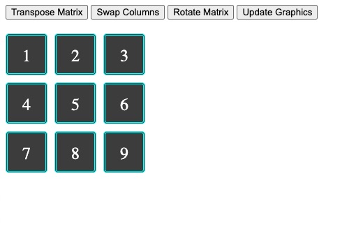

# Rotate Matrix Exercise

In this exercise i created a 2D array, 3x3.
This is a small part of a bigger project, in this exercise we learn a little bit of how we can rotate an image.
Instead of using pixels, that is a lot more complex, we are using an array to represent the pixels.

First a declared an 2Darray that goes from 1 to 9.
Then i created a function called swap. This function can change the position in the matrix.
Than i created another function called transpose. This function invert columns and rows.
After that i created the function moveCols. This functions move the columns position;
Then rotatematrix. This function only call both functions above, and obviously rotate the matrix.
For the end of this little project i needed to integrate this array to my grid section, so to do that i created another function called updateGraphics.
First I create a variable to store the div element, in this case was a class called "box".
Then i create 2 loop one inside another to loop over the array and append/push the data into the 3x3 grid section that i've created in my index.html file.

<h1>Matrix Operations Repository</h1>
This repository contains JavaScript code for performing various operations on a 2D array (matrix) and updating an HTML display grid with the matrix data.
<h2>Matrix Operations</h2>
The <code>array</code> variable in the code initializes a 2D array from 1 to 9 as follows:
<pre>

javascript<button class="flex ml-auto gap-2"><svg stroke="currentColor" fill="none" stroke-width="2" viewBox="0 0 24 24" stroke-linecap="round" stroke-linejoin="round" class="h-4 w-4" height="1em" width="1em" xmlns="http://www.w3.org/2000/svg"><path d="M16 4h2a2 2 0 0 1 2 2v14a2 2 0 0 1-2 2H6a2 2 0 0 1-2-2V6a2 2 0 0 1 2-2h2"></path><rect x="8" y="2" width="8" height="4" rx="1" ry="1"></rect></svg>Copy code</button>

<code class="!whitespace-pre hljs language-javascript">let array = 
[[1, 2, 3],
 [4, 5, 6],
 [7, 8, 9]];
</code>

</pre><ol><li>
<strong>Swap Function:</strong> The <code>swap</code> function allows swapping values between two positions in the 2D array. It takes the 2D array <code>A</code> and four indices <code>(i, j, k, l)</code>, and swaps the values at positions <code>(i, j)</code> and <code>(k, l)</code> in the array.
</li><li>
<strong>Transpose Function:</strong> The <code>transpose</code> function transposes the given 2D array by inverting its rows and columns. It takes the 2D array <code>A</code> as input and performs the necessary swaps to achieve the transpose.
</li><li>
<strong>Move Columns Function:</strong> The <code>moveCols</code> function switches columns in the 2D array. It moves the first column with the last one, the second column with the second last, and so on until the middle column is reached.
</li><li>
<strong>Rotate Matrix Function:</strong> The <code>rotateMatrix</code> function combines the <code>transpose</code> and <code>moveCols</code> functions to rotate the 2D matrix 90 degrees clockwise.
</li></ol><h2>Updating HTML Display</h2>
The code also includes a function called <code>updateGraphics</code> that updates the HTML display grid with the data from the 2D array. It uses the values from the 2D array and sets them as the inner text of corresponding HTML elements with the class name 'box'.
<h2>How to Use</h2>
To use these functions and visualize the matrix operations, you can follow these steps:
<ol><li>Clone this repository to your local machine.</li><li>Open the <code>index.html</code> file in a web browser.</li><li>You will see a 3x3 grid of boxes with initial values 1 to 9.</li><li>Click on the provided buttons to perform different operations on the matrix.</li><li>The <code>Transpose Matrix</code> button will transpose the matrix.</li><li>The <code>Swap Columns</code> button will move columns to the opposite side.</li><li>The <code>Rotate Matrix</code> button will rotate the matrix 90 degrees clockwise.</li><li>The <code>Update Graphics</code> button will apply the changes and display the updated matrix in the grid.</li></ol>
Feel free to modify the <code>array</code> variable to try different initial matrices and explore the functionalities of the code. Happy coding!

